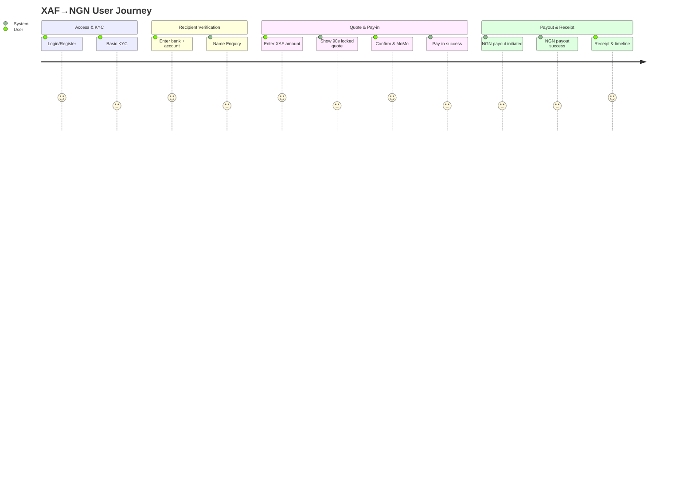

# TexaPay_XAF_to_NGN_Transfer_Plan.md

## Executive Summary
- Build a cross-border money transfer feature for Cameroon users (XAF) to send to Nigerian bank accounts (NGN).
- Pay-in via Mobile Money (MoMo) using pawaPay; automatic payout to NGN via Safe Haven MFB.
- FX derived from a USD-base cross-rate (USD→XAF and USD→NGN), used to compute XAF→NGN. A 90-second locked quote (countdown) is shown before payment.
- Minimal, basic KYC required (name, phone, simple ID capture). Users must authenticate; Admins have Filament dashboard access.
- No XAF payout in scope (no cash-out for Cameroon users).
- Core happy path: user authenticates → enters bank and account → name enquiry → enters XAF amount → quote shown and locked for 90s → user confirms → MoMo pay-in succeeds → automatic NGN payout via Safe Haven → receipt with status timeline.

## User Roles & Access
- End-user (Cameroon sender):
  - Register/login (authenticated usage required).
  - Complete basic KYC (name, phone, simple ID capture).
  - Start a bank transfer without adding/maintaining recipients.
  - Provide bank + account number; view verified recipient name via in-flow name enquiry.
  - Enter XAF amount; view quote with FX rate, fee(s), NGN receive; countdown for 90-second lock.
  - Confirm and pay via MoMo.
  - View receipt and transfer status timeline; see retry options when eligible.
- Admin (Filament dashboard):
  - Authenticate to access settings and operational tools.
  - Manage provider credentials, fees, margins/spreads, min/max limits, supported/blocked banks, quote TTL, maintenance toggles, feature flags, and copy/labels.
  - Review transfers, search/filter, view details/timelines, add notes, and apply basic refund/retry rules (requirements-level).
  - Audit changes (who/what/when) and export CSV summaries.
- Fraud/Abuse considerations (requirements-level):
  - Single authenticated user identity per device/session.
  - Prevent duplicate payment attempts within a quote lock window and block multiple concurrent transfers by the same user.
  - Apply transaction limits and basic velocity checks to deter abuse.
  - Provide clear denials and support paths when policies block transactions.

## Assumptions & Dependencies
- APIs:
  - Safe Haven MFB:
    - Name Enquiry: input bank code + account number → returns account name, bank metadata, validation status, reference.
    - NGN Payout: input transaction reference, beneficiary details (bank, account number, name), amount NGN → returns payout reference, status (pending/success/failed), and error codes/messages on failure.
  - pawaPay (MoMo pay-in):
    - Pay-in initiation: input XAF amount, user MSISDN, metadata, callback URLs/IDs → returns pay-in reference and initial status.
    - Status updates: pending/success/failed/canceled; webhooks and pull status supported.
  - FX Source (USD-base):
    - Returns USD→XAF and USD→NGN mid-rates, timestamps, and possibly market source references.
- Expected API returns (requirements-level):
  - Names/References: unique provider references for reconciliation; timestamps; status enums; reason/error codes; bank code/name lists.
  - Statuses: standardized mapping to internal states (e.g., quote_created, payin_pending, payin_success, payout_pending, payout_success, failed).
- Out of scope:
  - No recipient address book (no “Add recipient”).
  - No XAF payouts.
  - No tiered KYC (basic only).

## End-to-End User Flows (Step-by-Step)
### a. KYC & Auth (basic)
- Screen: Login/Register.
  - Messages: “Sign in to transfer money”; “Create an account.”
- Screen: Basic KYC capture.
  - Inputs: full name, phone number (MSISDN), simple ID capture (photo/upload or number), date of birth.
  - Messages: “We need a few details to comply with regulations.” Clear privacy notice and consent.

### b. Start Transfer (Transfer to Bank)
- Screen: Home/Transfer.
  - CTA: “Transfer to Bank (Nigeria).”
  - Note: “No XAF cash-out. Send to NGN bank accounts only.”

### c. Name Enquiry (bank + account → fetch account name)
- Screen: “Enter recipient bank details.”
  - Inputs: Bank (select from list), Account Number (10 digits).
  - Action: “Verify account name” triggers Safe Haven Name Enquiry.
- States:
  - Verifying: loading state.
  - Success: Show account name (read-only), bank name, and a reference note (e.g., “Verified by bank”).
  - Failure: Show clear error, retry option, guidance to recheck bank/account or try later.

### d. Quote & Breakdown
- Screen: “Enter amount to send (XAF).”
  - Input: XAF amount (respect min/max, whole-number or 2-decimal input per currency rules).
  - System: Fetch USD→XAF and USD→NGN, compute cross-rate XAF→NGN, apply margin/spread and fee rules.
  - Display: FX rate (XAF→NGN), fee(s), total XAF to pay, NGN receive, total cost transparency.
  - Show: 90-second quote lock with countdown timer; “Expires in 1:30.”
  - Actions: “Confirm & Pay” (enabled while lock active), “Refresh Quote” (on expiry).

### e. Confirm & Pay-in (MoMo via pawaPay)
- Screen: “Confirm payment.”
  - Summary: Recipient bank/name/acc. no., XAF amount, fee(s), total, NGN receive, quote expiry countdown.
  - On Confirm: Initiate pawaPay MoMo pay-in.
- States:
  - Pending: “Awaiting MoMo authorization… Follow prompts on your device.”
  - Success: “Payment received. Initiating NGN payout.”
  - Failed/Canceled: Show reason and offer “Try Again” (re-initiate within policy) or “Back to Quote.”

### f. Auto Payout to NGN (Safe Haven MFB)
- After pay-in success:
  - Initiate payout automatically.
- States:
  - Payout Initiated: “We’ve started your NGN payout.”
  - Payout Pending/Processing: “Usually completes within minutes.”
  - Payout Success: “NGN delivered to [bank • last-4 account].”
  - Payout Failed: Show clear reason and present allowed action (automatic retry rule, manual retry, or support).

### g. Receipt & Status Timeline
- Screen: “Transfer Receipt.”
  - Timeline stages:
    - Quote created.
    - Pay-in success.
    - NGN payout initiated.
    - NGN payout success.
  - For failures: indicate failed step with reason and next step (retry or contact support).
  - Provide: Transfer reference(s), date/time, XAF paid, fees, FX rate, NGN received, recipient details, and download/share options.

```mermaid
flowchart TD
  A[Login + Basic KYC] --> B[Transfer to Bank]
  B --> C[Enter Bank + Account No.]
  C -->|Name Enquiry (Safe Haven)| D{Name Verified?}
  D -- No --> C
  D -- Yes --> E[Enter XAF Amount]
  E -->|USD-base FX fetch| F[Show Quote + 90s Lock]
  F -->|Confirm| G[MoMo Pay-in (pawaPay)]
  G -->|Success| H[Auto NGN Payout (Safe Haven)]
  G -->|Fail/Cancel| F
  H -->|Success| I[Receipt + Status Timeline]
  H -->|Fail| J[Retry/Support per Policy]
```

## Admin Dashboard (Filament) Requirements
- Settings Management:
  - Provider credentials/keys (Safe Haven, pawaPay, FX source).
  - Fees & fee rules (fixed, percentage, slabs), FX margin/spread.
  - Min/max limits (per transfer, daily, rolling window), quote TTL (default 90s).
  - Maintenance toggles and feature flags (e.g., enable/disable pay-in/payout).
  - Supported/blocked banks; supported corridors (XAF→NGN only in this scope).
  - Compliance copy and labels (KYC notices, error messages, help text).
- Operational Views:
  - Transfers list with filters: status, provider, date range, amount range, user, bank.
  - Transfer detail page: full timeline, references (internal and provider), all amounts/rates/fees, recipient details, webhooks/history, notes.
  - Actions (requirements-level):
    - Retry payout (when policy allows).
    - Mark refund initiated/requested (for failed or canceled scenarios involving captured funds).
    - Add internal notes/tags.
- Audit & Logs (requirements-level):
  - Record of setting changes (who/what/when/before-after).
  - Downloadable CSV summaries (transfers, fees collected, status aging).
- Content/Text Management:
  - Editable labels, help text, and error messages for end-user UI.

## Breakdown Calculations (Requirements-Level)
- Inputs:
  - XAF amount (user-input).
  - FX rates from USD-base source:
    - USD→XAF, USD→NGN (with timestamps).
  - Margin/spread parameters.
  - Fee rules (fixed, percentage, slabs, min/max fee).
- Computation:
  - Cross-rate: XAF→NGN = (USD→NGN) / (USD→XAF).
  - Apply margin/spread to derived XAF→NGN rate as per admin settings.
  - Compute fees:
    - Percentage fee = percentage of XAF amount (or NGN receive if configured; default XAF).
    - Fixed fee added on top; respect min/max fee caps.
  - NGN receive:
    - NGN receive = (XAF amount − applicable sender fees if fees are deducted from send) × adjusted XAF→NGN rate.
    - If fees are charged on top, display total XAF to pay = XAF amount + fees; NGN receive computed off the XAF amount as configured.
- Outputs:
  - Adjusted FX rate (XAF→NGN).
  - Fee(s) detail (fixed, percentage, total).
  - Total XAF to pay.
  - NGN receive amount.
  - Quote reference, created time, and expiry time (T+90s default).
- Rounding/precision and display:
  - FX rate: display to 6 decimal places; internal precision sufficient to avoid rounding errors.
  - XAF: display to 0 or 2 decimals based on regional norms (admin-configurable; default 0 decimals if supported).
  - NGN: display to 2 decimals.
  - Always present clear totals: “You pay (XAF)”, “Fees (XAF)”, “Recipient gets (NGN)”.
- 90-second lock behavior:
  - During lock: amounts frozen; button enabled; countdown visible.
  - On expiry: disable confirm; show “Quote expired—Refresh to get a new rate.”
  - Refresh produces a new quote reference and countdown.

## States, Errors & Edge Cases (Non-technical)
- Name Enquiry failures:
  - Show: “We couldn’t verify this account. Check details and try again.”
  - Allow retries; if provider outage suspected, suggest trying later.
- Quote expiry:
  - On expiry, disable confirm; provide “Refresh Quote” to fetch latest rate.
  - Prevent usage of expired quotes for payment.
- MoMo pay-in:
  - Pending: “Awaiting authorization…” with guidance to complete steps on device/network.
  - Failed: show reason (insufficient funds, timeout, user canceled); offer retry or back to quote.
  - Canceled: user can start a fresh quote and attempt again.
- NGN payout:
  - Pending: show processing state and reassurance on timelines.
  - Failed (temporary): auto or manual retry per policy; inform user “We’re retrying your payout.”
  - Failed (permanent): initiate refund path if funds captured; inform user and provide support contact.
- Partial outages:
  - FX source down: “Rate unavailable—please try again later.”
  - Safe Haven down: block name enquiry/payout with clear message and optional waitlist/notify.
  - pawaPay down: block pay-in initiation with clear message.
- Duplicate attempt prevention:
  - Prevent reusing the same quote after expiry or after a terminal outcome.
  - Debounce multiple pay-in submissions within the same lock window.
  - Prevent multiple concurrent transfers by the same user when one is in a critical pending state (pay-in/payout).

## Compliance, Risk & CX Safeguards (Requirements-Level)
- Basic KYC:
  - Collect and verify name, phone, simple ID capture; block transfers without completion.
- Transaction limits:
  - Enforce per-transfer min/max, daily totals, and rolling window limits; display remaining limits.
  - When hit: show polite denial with reason and when user may try again.
- Sanctions/PEP hooks:
  - System must support checks against sanctions/PEP lists (policy-level); block or hold as per policy; present friendly messages and support path.
- Clear copy:
  - Denials and holds explain “what happened” and “what to do next.”
  - Always show provider-agnostic, user-friendly language.

## Non-Functional Requirements (Business-Facing)
- Reliability/Uptime:
  - Target high availability for user-critical flows; graceful degradation during provider outages.
- Performance:
  - Snappy quote generation (under 2 seconds under normal conditions); immediate status refresh post-pay-in.
- Transparency:
  - Always show fees and rates clearly before payment.
- Accessibility & Localization:
  - Support clear, legible UI; language and currency formatting appropriate for Cameroon and Nigeria.
- Receipts/Downloads:
  - Provide shareable and downloadable receipts from history.
- Observability (requirements-level):
  - Track user funnel drop-offs, error rates by provider, payout completion times, refund rates, and retried payouts—viewable in admin analytics.
  - Provider latency metrics: measure and display median/percentile time from MoMo pay-in success to NGN payout completion; include distribution over selectable date ranges.

## Reconciliation & Transparency (Requirements-Level)
- Admin visibility:
  - Counts and sums by day/status/provider.
  - Status aging buckets (e.g., pending >30 min).
  - Fee and margin revenue summaries.
  - Provider reference mappings for each transaction (quote, pay-in, payout).
  - Provider latency and success-rate summaries (MoMo→Payout).
- User history:
  - Show past transfers with: date/time, XAF paid, fees, FX rate, NGN received, recipient bank/account (masked), internal and provider reference IDs, and final status.

## Acceptance Criteria (UAT-Ready, Clear & Testable)
- KYC & Auth:
  - User cannot initiate transfer without login and basic KYC completion.
  - KYC fields captured and stored; error messages are clear on missing inputs.
- Name Enquiry:
  - Given valid bank + account number, system displays account name and verification success.
  - On failure, user sees clear error and can retry.
- Quote:
  - After entering XAF amount, system shows FX rate, fees, NGN receive, and 90-second countdown.
  - Confirm is disabled when the quote expires; “Refresh Quote” fetches a new rate and reference.
  - Negative: If user tries to confirm after quote expiry, confirmation is blocked and a refresh is required.
- Pay-in:
  - On Confirm, pawaPay is initiated; pending status shown until success or failure.
  - On success, system immediately transitions to payout step.
  - On fail/cancel, user gets reason and can retry or return to quote.
- Payout:
  - On pay-in success, payout is automatically initiated via Safe Haven; status transitions from pending to success or fail.
  - On payout fail (temporary), system attempts retry per policy and surfaces status to user/admin.
  - On payout permanent fail, refund/next steps presented per policy.
- Concurrency & Duplicate Prevention:
  - If user attempts multiple concurrent transfers, the second attempt is blocked until the first reaches a terminal or safe intermediate state (per policy); user sees a clear message.
  - Expired or already-consumed quotes cannot be reused.
- Receipt:
  - Receipt displays references, fees, rates, amounts, and full timeline in order.
  - User can access receipt from transfer history.
- Admin:
  - Admin can update settings (keys, fees, margins, min/max, quote TTL, banks, toggles).
  - Audit log shows who changed what and when.
  - Transfers list is filterable; detail pages show full timeline and references.
  - CSV export available for summaries.
  - Observability shows provider latency metrics from MoMo success to NGN payout completion.
- Sample Scenarios:
  - Happy path: name enquiry success → quote locked → pay-in success → payout success → receipt accurate.
  - Name enquiry fail: error shown; retry works; on success, flow proceeds.
  - Quote expiry: confirm disabled post-90s; refresh generates a new quote with updated rate; attempts to confirm are blocked until refresh.
  - MoMo pending then success: pending state visible; on success, auto payout triggered; receipt updated.
  - MoMo fail: error shown; retry allowed per policy; subsequent success proceeds to payout.
  - Payout retry then success: initial payout fail triggers retry; success reflected in timeline.
  - Payout permanent fail → refund: user and admin see failure reason; refund/next steps clearly presented.
  - Concurrent transfer attempt: second transfer blocked while first is in pending/pay-in/payout; user gets a clear message to wait or cancel.

## Open Questions & Decisions Needed
- API Gaps:
  - Exact status enums and mapping for pawaPay and Safe Haven (pending, success, fail, canceled, timeout).
  - Name Enquiry response fields (canonical account name, bank code standards, reference format).
  - Payout error codes and retryability classification from Safe Haven.
  - Webhook vs. polling guarantees (delivery, idempotency keys, deduplication windows).
  - FX source: refresh cadence, guaranteed timestamp, fallback behavior.
- Policy Choices:
  - Fee structure (sender pays on top vs. deducted from send; fee caps).
  - Margin/spread policy and rounding rules.
  - Min/max per-transfer and daily/rolling limits.
  - Payout retry rules (count, intervals), refund timelines (time to return funds on permanent payout failure), and customer communication standards.
  - Supported/blocked bank list and freshness cadence.
  - Decimal display standard for XAF (0 vs. 2 decimals) and any regional preferences.
- CX Decisions:
  - Exact copy for major states (pending, retry, fail), languages supported, accessibility standards.
  - Whether to allow “save recipient” in future phases (out of scope now).


