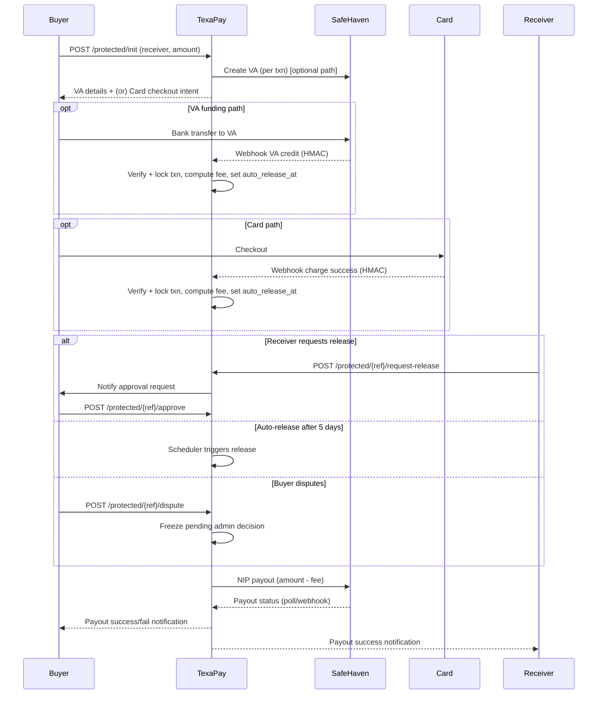
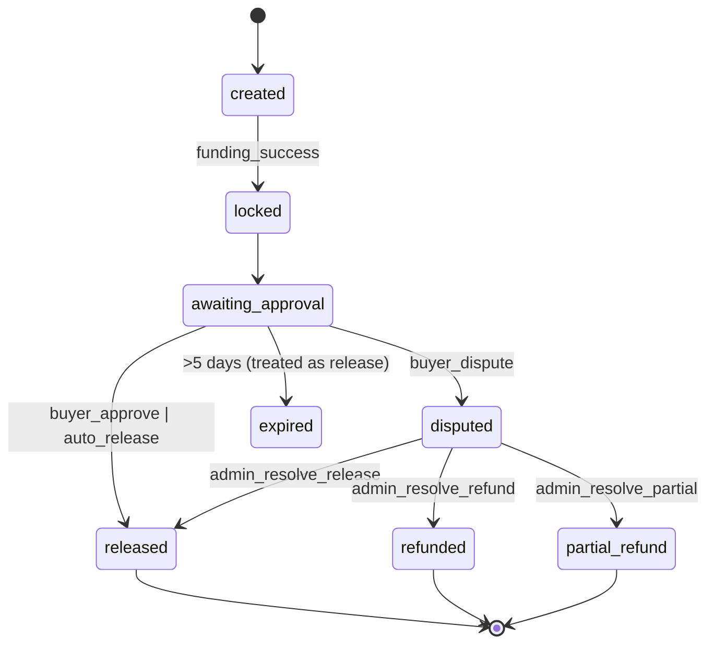

Design & Integration Plan: Texa Protected (Escrow-Style Transfers)

1) Codebase discovery (grounded inventory)

- Framework/stack
  - Laravel 12, PHP 8.2. Packages include Sanctum, Filament, Horizon, JWT (firebase/php-jwt).
  - Composer: [composer.json](cci:7://file:///Users/macbookpro/Desktop/texapayrrem/composer.json:0:0-0:0) shows key deps. Admin UI via Filament 4.

- Project structure and key modules
  - API routes: [routes/api.php](cci:7://file:///Users/macbookpro/Desktop/texapayrrem/routes/api.php:0:0-0:0) (mobile JSON API under `/api/mobile/...`)
  - Web routes: [routes/web.php](cci:7://file:///Users/macbookpro/Desktop/texapayrrem/routes/web.php:0:0-0:0) (web UI flows + webhooks)
  - Controllers:
    - Mobile transfers orchestration: [app/Http/Controllers/Api/TransfersController.php](cci:7://file:///Users/macbookpro/Desktop/texapayrrem/app/Http/Controllers/Api/TransfersController.php:0:0-0:0)
    - Web transfers orchestration: [app/Http/Controllers/TransferController.php](cci:7://file:///Users/macbookpro/Desktop/texapayrrem/app/Http/Controllers/TransferController.php:0:0-0:0)
    - Webhooks (PawaPay deposits/payouts): [app/Http/Controllers/Webhooks/PawaPayWebhookController.php](cci:7://file:///Users/macbookpro/Desktop/texapayrrem/app/Http/Controllers/Webhooks/PawaPayWebhookController.php:0:0-0:0), [PawaPayPayoutWebhookController.php](cci:7://file:///Users/macbookpro/Desktop/texapayrrem/app/Http/Controllers/Webhooks/PawaPayPayoutWebhookController.php:0:0-0:0)
    - Banks and KYC: [app/Http/Controllers/BankController.php](cci:7://file:///Users/macbookpro/Desktop/texapayrrem/app/Http/Controllers/BankController.php:0:0-0:0), `app/Http/Controllers/Kyc/...`
  - Services:
    - Safe Haven integration: [app/Services/SafeHaven.php](cci:7://file:///Users/macbookpro/Desktop/texapayrrem/app/Services/SafeHaven.php:0:0-0:0) (name enquiry, payout, payout status, token generation)
    - PawaPay integration: [app/Services/PawaPay.php](cci:7://file:///Users/macbookpro/Desktop/texapayrrem/app/Services/PawaPay.php:0:0-0:0) (deposit init/status)
    - Pricing and FX: `app/Services/OpenExchangeRates.php` (referenced), `app/Services/PricingEngine.php`
    - Notifications: [app/Services/NotificationService.php](cci:7://file:///Users/macbookpro/Desktop/texapayrrem/app/Services/NotificationService.php:0:0-0:0) (referenced by jobs/controllers)
  - Jobs:
    - PawaPay deposit processing: [app/Jobs/ProcessPawaPayDeposit.php](cci:7://file:///Users/macbookpro/Desktop/texapayrrem/app/Jobs/ProcessPawaPayDeposit.php:0:0-0:0)
    - Refunds, notifications: [app/Jobs/ProcessPawaPayRefund.php](cci:7://file:///Users/macbookpro/Desktop/texapayrrem/app/Jobs/ProcessPawaPayRefund.php:0:0-0:0), [SendEmailNotification.php](cci:7://file:///Users/macbookpro/Desktop/texapayrrem/app/Jobs/SendEmailNotification.php:0:0-0:0), [SendSmsNotification.php](cci:7://file:///Users/macbookpro/Desktop/texapayrrem/app/Jobs/SendSmsNotification.php:0:0-0:0), [SendPushNotification.php](cci:7://file:///Users/macbookpro/Desktop/texapayrrem/app/Jobs/SendPushNotification.php:0:0-0:0)
  - Console/schedulers:
    - [app/Console/Kernel.php](cci:7://file:///Users/macbookpro/Desktop/texapayrrem/app/Console/Kernel.php:0:0-0:0) schedules payout reconciliation, transfer reconciliation, AML/Screening jobs.
    - Reconcile payouts: [app/Console/Commands/ReconcilePayouts.php](cci:7://file:///Users/macbookpro/Desktop/texapayrrem/app/Console/Commands/ReconcilePayouts.php:0:0-0:0)
  - Admin backoffice (Filament):
    - Transfers table: [app/Filament/Resources/Transfers/Tables/TransfersTable.php](cci:7://file:///Users/macbookpro/Desktop/texapayrrem/app/Filament/Resources/Transfers/Tables/TransfersTable.php:0:0-0:0)
    - Settings table: [app/Filament/Resources/Settings/Tables/SettingsTable.php](cci:7://file:///Users/macbookpro/Desktop/texapayrrem/app/Filament/Resources/Settings/Tables/SettingsTable.php:0:0-0:0)
  - Mobile OpenAPI: [openapi/mobile-openapi.yaml](cci:7://file:///Users/macbookpro/Desktop/texapayrrem/openapi/mobile-openapi.yaml:0:0-0:0)
  - Docs: `docs/...` including admin wiring and transaction plans.

- Current integrations
  - Safe Haven (MFB):
    - OAuth2 client-assertion flow in [SafeHaven::getAccessToken()](cci:1://file:///Users/macbookpro/Desktop/texapayrrem/app/Services/SafeHaven.php:96:4-183:5)
    - Name enquiry [SafeHaven::nameEnquiry()](cci:1://file:///Users/macbookpro/Desktop/texapayrrem/app/Services/SafeHaven.php:412:4-463:5)
    - NIP payout [SafeHaven::payout()](cci:1://file:///Users/macbookpro/Desktop/texapayrrem/app/Services/SafeHaven.php:465:4-527:5), status [SafeHaven::payoutStatus()](cci:1://file:///Users/macbookpro/Desktop/texapayrrem/app/Services/SafeHaven.php:529:4-571:5)
    - Health/banks endpoints: `/health/safehaven*` in [routes/web.php](cci:7://file:///Users/macbookpro/Desktop/texapayrrem/routes/web.php:0:0-0:0) and [routes/api.php](cci:7://file:///Users/macbookpro/Desktop/texapayrrem/routes/api.php:0:0-0:0)
  - PawaPay (MoMo pay-in):
    - Deposit initiation [PawaPay::initiatePayIn()](cci:1://file:///Users/macbookpro/Desktop/texapayrrem/app/Services/PawaPay.php:172:4-269:5)
    - Deposit status [PawaPay::getPayInStatus()](cci:1://file:///Users/macbookpro/Desktop/texapayrrem/app/Services/PawaPay.php:271:4-304:5)
    - Webhooks for deposits: [routes/web.php](cci:7://file:///Users/macbookpro/Desktop/texapayrrem/routes/web.php:0:0-0:0) → `/webhooks/pawapay` etc. Handler [PawaPayWebhookController](cci:2://file:///Users/macbookpro/Desktop/texapayrrem/app/Http/Controllers/Webhooks/PawaPayWebhookController.php:13:0-214:1) with idempotent event store (`WebhookEvent`).

- Database schema (selected)
  - Transfers: [database/migrations/2025_09_25_233450_create_transfers_table.php](cci:7://file:///Users/macbookpro/Desktop/texapayrrem/database/migrations/2025_09_25_233450_create_transfers_table.php:0:0-0:0) (+ payout safety fields)
    - Recipient bank fields, FX and fee snapshots, payin & payout refs/statuses, overall `status`, JSON [timeline](cci:1://file:///Users/macbookpro/Desktop/texapayrrem/app/Http/Controllers/TransferController.php:930:4-948:5).
    - Additional columns: `payout_idempotency_key`, `payout_attempted_at`, `last_payout_error`.
  - Settings and flags: [app/Models/AdminSetting.php](cci:7://file:///Users/macbookpro/Desktop/texapayrrem/app/Models/AdminSetting.php:0:0-0:0), [app/Models/Settings/FeatureFlag.php](cci:7://file:///Users/macbookpro/Desktop/texapayrrem/app/Models/Users/macbookpro/Desktop/texapayrrem/app/Models/Settings/FeatureFlag.php:0:0-0:0) and migrations exist for feature flags and fees/limits settings.
  - Webhook events: [database/migrations/2025_09_28_010000_create_webhook_events_table.php](cci:7://file:///Users/macbookpro/Desktop/texapayrrem/database/migrations/2025_09_28_010000_create_webhook_events_table.php:0:0-0:0) (referenced by webhook code).

- Existing transfer flow (non-protected)
  - User verifies recipient via SafeHaven name enquiry ([TransferController::verifyBank()](cci:1://file:///Users/macbookpro/Desktop/texapayrrem/app/Http/Controllers/TransferController.php:107:4-133:5) / [Api\TransfersController::nameEnquiry()](cci:1://file:///Users/macbookpro/Desktop/texapayrrem/app/Services/SafeHaven.php:412:4-463:5)).
  - Quote ([TransferController::createQuote()](cci:1://file:///Users/macbookpro/Desktop/texapayrrem/app/Http/Controllers/TransferController.php:165:4-249:5) / [Api\TransfersController::quote()](cci:1://file:///Users/macbookpro/Desktop/texapayrrem/app/Http/Controllers/Api/TransfersController.php:288:4-398:5)).
  - Pay-in initiation via PawaPay (MoMo) ([TransferController::confirmPayIn()](cci:1://file:///Users/macbookpro/Desktop/texapayrrem/app/Http/Controllers/TransferController.php:253:4-520:5) and API [confirm()](cci:1://file:///Users/macbookpro/Desktop/texapayrrem/app/Http/Controllers/Api/TransfersController.php:400:4-580:5)).
  - Deposit webhook received ([PawaPayWebhookController](cci:2://file:///Users/macbookpro/Desktop/texapayrrem/app/Http/Controllers/Webhooks/PawaPayWebhookController.php:13:0-214:1) → queues [ProcessPawaPayDeposit](cci:2://file:///Users/macbookpro/Desktop/texapayrrem/app/Jobs/ProcessPawaPayDeposit.php:17:0-418:1)) → on COMPLETED, auto-initiates payout via SafeHaven.
  - Payout reconciliation via command [ReconcilePayouts](cci:2://file:///Users/macbookpro/Desktop/texapayrrem/app/Console/Commands/ReconcilePayouts.php:9:0-61:1) and via controller methods [initiatePayout()](cci:1://file:///Users/macbookpro/Desktop/texapayrrem/app/Jobs/ProcessPawaPayDeposit.php:191:4-417:5); uses SafeHaven idempotency ref and status polling.

- Observability
  - Extensive `\Log::info/error/warning` throughout controllers/services/jobs.
  - Transfer [timeline](cci:1://file:///Users/macbookpro/Desktop/texapayrrem/app/Http/Controllers/TransferController.php:930:4-948:5) JSON captures state changes with timestamps and provider responses.
  - Horizon for queues; logging config present ([config/logging.php](cci:7://file:///Users/macbookpro/Desktop/texapayrrem/config/logging.php:0:0-0:0)).

- Security
  - Mobile API uses a custom JWT flow (`TokenAuthController` and `auth.jwt` middleware); Sanctum present but mobile endpoints authenticate with JWT.
  - CSRF disabled selectively for API POSTs.
  - Idempotency:
    - Middleware declared in [routes/api.php](cci:7://file:///Users/macbookpro/Desktop/texapayrrem/routes/api.php:0:0-0:0) (`'idempotency'`), and [Api\TransfersController::idempotent()](cci:1://file:///Users/macbookpro/Desktop/texapayrrem/app/Http/Controllers/Api/TransfersController.php:223:4-242:5) caches responses keyed by user + `Idempotency-Key`.
    - Webhooks idempotency: `WebhookEvent` uniqueness on provider event id.
  - Webhook signature verification: TODO noted in [PawaPayWebhookController](cci:2://file:///Users/macbookpro/Desktop/texapayrrem/app/Http/Controllers/Webhooks/PawaPayWebhookController.php:13:0-214:1) (X-Signature not yet verified). HMAC to be added.

- Notification channels
  - Push, email, SMS jobs and `NotificationService` used in [ProcessPawaPayDeposit](cci:2://file:///Users/macbookpro/Desktop/texapayrrem/app/Jobs/ProcessPawaPayDeposit.php:17:0-418:1) to notify on pay-in success/fail; also used in controllers.

- Extension points for Protected
  - After quote but before pay-in in [TransferController::confirmPayIn()](cci:1://file:///Users/macbookpro/Desktop/texapayrrem/app/Http/Controllers/TransferController.php:253:4-520:5) and [Api\TransfersController::confirm()](cci:1://file:///Users/macbookpro/Desktop/texapayrrem/app/Http/Controllers/Api/TransfersController.php:400:4-580:5) to branch into Protected init path.
  - Webhooks infrastructure: add new webhook controllers and reuse `WebhookEvent` model for Safe Haven VA credits and card provider events.
  - Admin/Filament for dispute management and settings via [SettingsTable](cci:2://file:///Users/macbookpro/Desktop/texapayrrem/app/Filament/Resources/Settings/Tables/SettingsTable.php:16:0-183:1) and new resources.
  - Scheduler: add auto-release job in [app/Console/Kernel.php](cci:7://file:///Users/macbookpro/Desktop/texapayrrem/app/Console/Kernel.php:0:0-0:0).

2) Gap analysis (what exists vs what’s needed for Protected)

- Exists
  - Provider adapters for SafeHaven (name enquiry, payouts), PawaPay (deposits), webhook event storage, idempotency guards, queueing.
  - Transfers table for normal remittances (XAF->NGN).
  - Notifications infra and admin UI.

- Needed for Protected
  - Transaction model and states:
    - Required states: created → funded_locked → awaiting_approval → [released|disputed|expired].
    - Current `transfers.status` states don’t map to escrow lifecycle. New model/table needed or extend with `type` and `protection_*` fields without breaking existing flows.
  - Funding options:
    - Card checkout: no Paystack code found (grep for “paystack” returns none). Need a minimal card provider adapter (either SafeHaven card if available, or Paystack/Flutterwave). Behind feature flags.
    - Temporary Virtual Account (VA): SafeHaven service lacks methods for VA issuance and incoming credit webhook handling. Need endpoints and webhook consumer to detect per-transaction credits.
  - Webhooks:
    - SafeHaven webhook for incoming VA credit (funding success -> set locked).
    - Card webhook for successful authorization/capture (funding success -> set locked).
    - HMAC signature verification (middleware).
    - Idempotent handling with provider event IDs stored.
  - Fee engine:
    - Tiered model in NGN with cap: ₦1–₦100,000 → 3% + ₦100; ₦100,001–₦1,000,000 → 2.5% + ₦100 capped at ₦2,000; ₦1,000,001+ → ₦2,000 flat.
    - Compute at lock time; store snapshot; deduct before payout.
  - Auto-release scheduler:
    - Default 5 days after lock if no action; mark funds releasable; auto-trigger payout.
  - Dispute model:
    - Entities to represent dispute opened by buyer; freeze funds; admin resolve (release/refund/partial).
    - Admin UI endpoints in Filament.
  - Audit trail:
    - Add state transition audit log for protected transactions (similar to transfer.timeline but with escrow states).
  - Compliance and security:
    - HMAC-verified webhooks, idempotency keys, audit logs, admin resolution auditing.

- Risks/tech debt
  - Current “Transfer” model is tailored to remittance corridor (XAF->NGN), FX fields, and PawaPay pay-in. Protected is NGN-only; mixing could confuse.
  - No card provider code; integrating card is non-trivial—recommend phased approach: start with VA funding only, add card next.
  - SafeHaven VA API details not implemented; confirm capabilities and webhook formats.
  - Webhook signature verification missing; add generalized middleware.

3) Proposed architecture (inside TexaPay)

- Data model options
  - Option A (recommended): New table `protected_transactions` for Texa Protected, independent from `transfers`.
    - Rationale: Protected is NGN-native, two-party (buyer, receiver), escrow lifecycle; avoids coupling with FX/legacy states.
  - Option B: Extend `transfers` with `type=protected`, `protection_state`, and NGN-only fields. Higher risk of back-compat conflicts. Not recommended.

- ProtectedTransaction fields (core)
  - buyer_user_id (FK users)
  - receiver_bank_code, receiver_bank_name, receiver_account_number, receiver_account_name
  - amount_ngn_minor
  - fee_ngn_minor, fee_rule_version, fee_breakdown (JSON)
  - funding_source: enum [card, virtual_account]
  - funding_provider: string (e.g., safehaven_va, paystack)
  - funding_ref, funding_status: enum [pending, success, failed]
  - escrow_state: enum [created, locked, awaiting_approval, released, disputed, expired]
  - auto_release_at (datetime), locked_at, released_at, disputed_at, resolved_at
  - payout_ref, payout_status
  - va_account_number, va_bank_code, va_reference (if VA funded)
  - card_intent_id, card_provider_ref (if card)
  - webhook_event_ids (JSON of processed IDs)
  - audit_timeline (JSON), plus an `protected_audit_logs` table for immutable logs

- State machine and guards
  - created → locked (on funding webhook success). Guard: amount matched, provider event validated, idempotent.
  - locked → awaiting_approval (immediate after lock; or combine both).
  - awaiting_approval:
    - → released (buyer approves OR auto-release timer). Action: compute payout net of fee; call [SafeHaven::payout()](cci:1://file:///Users/macbookpro/Desktop/texapayrrem/app/Services/SafeHaven.php:465:4-527:5).
    - → disputed (buyer disputes). Action: freeze; no payout until admin resolve.
    - → expired (auto 5 days lapse with no action; treated as release by default per business rule).
  - disputed → [released | refunded | partial_refund] via admin actions.
  - All transitions append to `audit_timeline` and to `protected_audit_logs`.

- Provider interfaces
  - SafeHaven adapter additions in [app/Services/SafeHaven.php](cci:7://file:///Users/macbookpro/Desktop/texapayrrem/app/Services/SafeHaven.php:0:0-0:0):
    - virtualAccountCreate(per-transaction), virtualAccountClose(optional).
    - webhook verification util (HMAC header parse/verify).
    - map VA credit webhook payload to identify `protected_transaction` by VA reference.
  - Card provider adapter (phase 2):
    - `app/Services/Card/*Provider.php` with `createCheckoutIntent(amount_ngn_minor, metadata)` and webhook verification.
    - Behind feature flag; initial implementation could be `PaystackProvider` (if chosen) or SafeHaven card if available.
  - Payout reuse:
    - Reuse existing [SafeHaven::payout()](cci:1://file:///Users/macbookpro/Desktop/texapayrrem/app/Services/SafeHaven.php:465:4-527:5) and [payoutStatus()](cci:1://file:///Users/macbookpro/Desktop/texapayrrem/app/Services/SafeHaven.php:529:4-571:5) for release.

- Webhook verification & idempotency
  - Add `app/Http/Middleware/VerifyProviderHmac.php` to verify request signatures using provider secret per route.
  - Extend `WebhookEvent` with `context_type=context_id=protected_transaction` for correlation and uniqueness on `provider+type+event_id`.
  - Store provider event IDs in `protected_transactions.webhook_event_ids` as processed set.

- Fee calculation service
  - New `app/Services/ProtectedFeeService.php` with pure function `calculate(amount_ngn_minor): { fee_ngn_minor, fee_components, capped }`.
  - Called at lock time; store snapshot on the protected transaction; never recalc later.

- Notifications
  - At key events via `NotificationService`:
    - lock (funded and held).
    - request release (receiver).
    - approve (buyer) → payout started.
    - dispute filed.
    - payout success/fail.
    - auto-release.

- Observability
  - Structured logs include `protected_txn_id`, `correlation_id` (from provider ref), and state transitions.
  - Business metrics via logs or a new `DailyProtectedSummary` (optional).

- High-level flow diagram

- State machine

4) Database changes (safe migrations)

- New tables
  - `protected_transactions`
    - id PK
    - buyer_user_id FK users
    - receiver_bank_code (string 32), receiver_bank_name (string), receiver_account_number (string 32), receiver_account_name (string)
    - amount_ngn_minor (bigint unsigned)
    - fee_ngn_minor (bigint unsigned default 0)
    - fee_rule_version (string 20), fee_components (json nullable)
    - funding_source (enum: card, virtual_account)
    - funding_provider (string 50), funding_ref (string 100 unique), funding_status (string 20)
    - escrow_state (string 30, indexed), auto_release_at (datetime indexed)
    - locked_at, released_at, disputed_at, resolved_at (datetimes)
    - payout_ref (string 100 unique nullable), payout_status (string 20 nullable), payout_attempted_at, payout_completed_at (datetimes)
    - va_account_number (string 32), va_bank_code (string 32), va_reference (string 100)
    - card_intent_id (string 100), card_provider_ref (string 100)
    - webhook_event_ids (json), audit_timeline (json)
    - created_at, updated_at
    - Indexes:
      - (buyer_user_id, escrow_state)
      - (escrow_state)
      - (auto_release_at)
      - unique(funding_ref), unique(payout_ref)
      - optional: (receiver_account_number)

  - `protected_audit_logs`
    - id, protected_transaction_id (FK), actor_type enum [system,buyer,receiver,admin,provider], actor_id nullable
    - from_state, to_state, at (datetime), reason (string), meta (json)
    - created_at

- Rollback plan
  - Drop new tables only; no destructive changes to existing `transfers`.
  - Deploy migrations behind feature flag; do not alter production data paths.

5) API surface & routing

- New endpoints (mobile API; JWT auth; idempotency header where actions)
  - POST `/api/mobile/protected/init`
    - Body: { receiver: { bankCode, accountNumber }, amountNgnMinor: number, note?: string, preferredFunding?: 'card'|'va' }
    - Response: { ref, escrowState: 'created', funding: { va?: { bankCode, accountNumber, reference }, card?: { checkoutUrl or intent } }, autoReleaseAt }
    - Flow: verifies receiver name via [SafeHaven::nameEnquiry()](cci:1://file:///Users/macbookpro/Desktop/texapayrrem/app/Services/SafeHaven.php:412:4-463:5), creates ProtectedTransaction in created state, issues VA and/or card intent.

  - POST `/api/mobile/protected/{ref}/request-release` (receiver-authenticated)
    - Body: {}
    - Response: { success: true }
    - Side effect: marks a flag to notify buyer; state remains awaiting_approval.

  - POST `/api/mobile/protected/{ref}/approve` (buyer-authenticated) [Idempotency-Key required]
    - Body: {}
    - Response: { success: true, payout: { status, payoutRef } }
    - Guard: must be locked/awaiting_approval, not disputed/expired. Initiates SafeHaven payout for net amount (amount - fee).

  - POST `/api/mobile/protected/{ref}/dispute` (buyer-authenticated) [Idempotency-Key required]
    - Body: { reason: string, details?: string }
    - Response: { success: true, state: 'disputed' }
    - Effect: freeze; no payout until admin resolve.

  - GET `/api/mobile/protected/{ref}` (either party)
    - Shows summary including current state, amounts, timelines (sanitized).

  - Admin endpoints (Filament API or classic):
    - POST `/api/admin/protected/{id}/resolve` with { action: release|refund|partial, partialAmountNgnMinor?, note }
    - GET list/filter by state.

- Webhooks
  - POST `/webhooks/safehaven/va-credits`
    - HMAC verified. Body includes accountNumber, amount, reference, transactionId, eventId.
    - Maps to ProtectedTransaction by `va_account_number` or `va_reference`.
    - Idempotent via `WebhookEvent` creation (provider='safehaven', type='va_credit', event_id).
    - On success: transitions → locked + awaiting_approval, computes fee snapshot, sets `auto_release_at=locked_at+5d`.

  - POST `/webhooks/card`
    - Provider-specific; verify signature; idempotent event store.
    - On success: transitions → locked + awaiting_approval.

- Auth/RBAC expectations
  - Buyer endpoints require ownership of `buyer_user_id`.
  - Receiver request-release requires a one-time token or linking the receiver (for simplicity initially: buyer performs approve; receiver’s request can be initiated by buyer’s app or by send a magic link to receiver).
  - Idempotency:
    - Approve/dispute require Idempotency-Key header; cache result keyed by user+route+key.

6) Provider integration plan

- SafeHaven reuse
  - Account name verification: reuse [SafeHaven::nameEnquiry()](cci:1://file:///Users/macbookpro/Desktop/texapayrrem/app/Services/SafeHaven.php:412:4-463:5).
  - Temporary virtual accounts:
    - Add methods in [SafeHaven](cci:2://file:///Users/macbookpro/Desktop/texapayrrem/app/Services/SafeHaven.php:7:0-572:1):
      - `createVirtualAccount({reference, amount?, expiresAt?})` → returns { bankCode, accountNumber, reference }
      - `closeVirtualAccount(reference)`
    - Confirm availability; if unavailable, fallback: use a pooled account with unique payment reference string and listen for incoming credits with that reference via webhook/statement (less preferred).
  - Incoming credit detection:
    - Prefer SafeHaven webhook for incoming account credits; route to `/webhooks/safehaven/va-credits`.
    - If webhook not provided, schedule a poller to check account statements and match credits by `va_reference` (polling window small; only for sandbox).
  - NIP payouts: reuse [SafeHaven::payout()](cci:1://file:///Users/macbookpro/Desktop/texapayrrem/app/Services/SafeHaven.php:465:4-527:5) and [payoutStatus()](cci:1://file:///Users/macbookpro/Desktop/texapayrrem/app/Services/SafeHaven.php:529:4-571:5); use idempotency key (protected txn ref) as `paymentReference`.

- Card integration
  - No Paystack integration present. Options:
    - Phase 1: Launch only VA funding (fastest, compliant).
    - Phase 2: Integrate Paystack or SafeHaven card rails:
      - Create `app/Services/Card/Paystack.php` with `createIntent()`, `verifyWebhook()`, and config in [config/services.php](cci:7://file:///Users/macbookpro/Desktop/texapayrrem/config/services.php:0:0-0:0).
      - Webhook route `/webhooks/card/paystack`.
    - Adhere to HMAC signature verification using the provider’s recommended header.

- Config/secrets
  - Add AdminSetting keys under `providers.safehaven.*` for VA and webhook secrets.
  - Extend [config/services.php](cci:7://file:///Users/macbookpro/Desktop/texapayrrem/config/services.php:0:0-0:0) with `safehaven.webhook_secret`, `paystack.secret`, `paystack.webhook_secret`.
  - Ensure HMAC middleware compares computed signature.

7) Business logic & timers

- Auto-release
  - Default 5 days after lock. Implement scheduler:
    - New command `protected:auto-release` checks `escrow_state='awaiting_approval' AND auto_release_at<=now()` → transitions to released and triggers payout.
    - Register in [app/Console/Kernel.php](cci:7://file:///Users/macbookpro/Desktop/texapayrrem/app/Console/Kernel.php:0:0-0:0) to run every 10 minutes.

- Dispute policy
  - Buyer can dispute while awaiting_approval; marks `escrow_state=disputed`, adds to admin queue.
  - Admin resolve actions:
    - release: proceed to payout as usual.
    - refund: return funds to buyer via reversal on provider (if SafeHaven supports inbound refund to original VA source) or escrow ledger at provider.
    - partial_refund (if provider supports split payout): otherwise fallback to full refund + new payout.

- Fee application
  - Compute at lock time via `ProtectedFeeService`.
  - Deduct fee before payout; store snapshot fields (amount, fee, net payable). Never recalculated after lock.
  - Record fee applied in `audit_timeline`.

8) Testing strategy

- Unit tests
  - Fee engine boundaries:
    - ₦100,000 edge (3% + ₦100)
    - ₦100,001 (2.5% + ₦100 capped at ₦2,000)
    - ₦1,000,000 (cap applies)
    - ₦1,000,001 (₦2,000 flat)
  - State machine transitions and guards for all paths.

- Integration tests
  - Webhook idempotency and HMAC verification (invalid/missing signature, duplicates).
  - SafeHaven VA webhook → lock and set auto_release_at.
  - Approve/dispute endpoints with Idempotency-Key behavior.

- E2E paths
  - Path A (VA):
    - init → VA funding webhook → lock → request-release → approve → payout → success.
  - Path B (Card):
    - init → card webhook → lock → request-release → approve → payout → success.
  - Auto-release flow (no user action): ensure payout initiated after 5 days (simulate clock).
  - Dispute flow: lock → dispute → admin resolve release/refund.
  - Load/perf: bulk webhook processing (queue workers), payout retries and reconciliation.

- Reconciliation
  - Poll payout status for protected payouts similar to [ReconcilePayouts](cci:2://file:///Users/macbookpro/Desktop/texapayrrem/app/Console/Commands/ReconcilePayouts.php:9:0-61:1) for robustness.

9) Rollout plan & observability

- Feature flags
  - `protected.enabled` (AdminSetting or `FeatureFlag`) default false.
  - `protected.card.enabled`, `protected.va.enabled` separate toggles.

- Staging plan
  - Use SafeHaven sandbox: VA creation, webhook callbacks to local `/webhooks/safehaven/va-credits`.
  - Verify HMAC checks, event idempotency, and payout end-to-end.
  - Initially roll out VA-only funding.

- Monitoring/KPIs (via logs + basic dashboard)
  - Funnel metrics: init → funded_locked → released, drop-offs.
  - Payout success ratio, time-to-lock, time-to-payout, dispute rate.
  - Alerts on webhook failures/HMAC mismatches and payout failures.

- Runbooks
  - Payout retry playbook: re-trigger release; reconcile status; when to refund.
  - Webhook replay: safe to re-send; idempotency handled via `WebhookEvent`.
  - Incident response for stuck auto-release or disputes backlog.

10) Deliverables to produce (implementation-ready)

- Repository inventory & architecture map
  - Summarized above with concrete references:
    - Transfers orchestration: [TransferController](cci:2://file:///Users/macbookpro/Desktop/texapayrrem/app/Http/Controllers/TransferController.php:26:0-995:1), `Api\TransfersController`.
    - Providers: [Services/SafeHaven.php](cci:7://file:///Users/macbookpro/Desktop/texapayrrem/app/Services/SafeHaven.php:0:0-0:0), [Services/PawaPay.php](cci:7://file:///Users/macbookpro/Desktop/texapayrrem/app/Services/PawaPay.php:0:0-0:0).
    - Webhooks: [Webhooks/PawaPayWebhookController.php](cci:7://file:///Users/macbookpro/Desktop/texapayrrem/app/Http/Controllers/Webhooks/PawaPayWebhookController.php:0:0-0:0).
    - Schedulers: [Console/Kernel.php](cci:7://file:///Users/macbookpro/Desktop/texapayrrem/app/Console/Kernel.php:0:0-0:0), [Commands/ReconcilePayouts.php](cci:7://file:///Users/macbookpro/Desktop/texapayrrem/app/Console/Commands/ReconcilePayouts.php:0:0-0:0).
    - Admin: `Filament/Resources/...`.

- Gap analysis/backlog (prioritized)
  - P0: Protected data model, VA funding path, SafeHaven VA webhook, fee service, approve/dispute endpoints, auto-release job, payout via SafeHaven, HMAC middleware, Filament admin for disputes.
  - P1: Card provider integration, receiver auth UX, protected dashboards/KPIs.
  - P2: Partial refunds (provider support), advanced observability.

- Data model changes
  - New migrations: `create_protected_transactions_table`, `create_protected_audit_logs_table`.
  - ERD (simplified):
    - User (buyer) 1—* ProtectedTransaction
    - ProtectedTransaction 1—* ProtectedAuditLog

- Diagrams
  - Included sequence/state diagrams above.

- API contract draft
  - As specified in section 5 with example shapes and idempotency.

- Integration notes
  - SafeHaven endpoints reused: `/transfers/name-enquiry`, `/transfers`, `/transfers/status`, plus VA issuance & webhook (to be added in service).
  - Card integration: modular adapter; optional.

- Testing plan
  - As per section 8, including idempotency/HMAC tests.

- Rollout/feature flags & monitoring
  - As per section 9.

- Risks & mitigations
  - Duplicate webhooks: handled via `WebhookEvent` unique event IDs and idempotent state transitions.
  - Payout reconciliation: reuse [ReconcilePayouts](cci:2://file:///Users/macbookpro/Desktop/texapayrrem/app/Console/Commands/ReconcilePayouts.php:9:0-61:1) pattern for protected payouts.
  - Partial refunds: clarify provider support; if unavailable, constrain MVP to full release/refund.

- Execution timeline (high-level)
  - Week 1: Discovery sign-off; finalize API, schema; implement migrations; ProtectedFeeService; HMAC middleware.
  - Week 2: ProtectedTransaction model; `/protected/init`; SafeHaven VA create; VA webhook handler + idempotency; state machine; auto-release scheduler; approve/dispute endpoints; payout integration.
  - Week 3: Filament admin for disputes; notifications; E2E tests for VA path; staging end-to-end; monitoring/log dashboards.
  - Week 4: Card adapter (optional P1); webhook integration; tests; staged rollout with feature flags.

11) Assumptions validated/proposed

- Laravel + MySQL: confirmed ([composer.json](cci:7://file:///Users/macbookpro/Desktop/texapayrrem/composer.json:0:0-0:0), migrations).
- SafeHaven integration present for name enquiry and payouts: present in [app/Services/SafeHaven.php](cci:7://file:///Users/macbookpro/Desktop/texapayrrem/app/Services/SafeHaven.php:0:0-0:0), routes.
- Virtual account issuance: not present; propose adding to [SafeHaven](cci:2://file:///Users/macbookpro/Desktop/texapayrrem/app/Services/SafeHaven.php:7:0-572:1) service.
- Card: no Paystack present; propose adding later; MVP with VA funding only.
- Notifications system: present (`NotificationService`, jobs).
- Admin panel: Filament present; add ProtectedTransaction resource and Dispute UI.

12) Open questions

- SafeHaven VA:
  - Do we have a VA issuance API on our SafeHaven tenant? If yes, endpoint paths and webhook payload/signature details?
  - If no VA issuance, is a pooled account plus unique transfer reference acceptable for MVP?

- Card rails:
  - Preferred provider: SafeHaven card vs Paystack vs Flutterwave?
  - Webhook signature scheme and fields? We’ll need provider secrets and test credentials.

- Receiver UX:
  - Should receivers have accounts, or do we rely on buyer-driven flows + notifications to receiver (SMS/email) with a link to request release?

- Payout reconciliation:
  - Any SafeHaven payout webhooks available, or rely on polling via [payoutStatus()](cci:1://file:///Users/macbookpro/Desktop/texapayrrem/app/Services/SafeHaven.php:529:4-571:5) as done today?

- Dispute resolution:
  - Are partial refunds supported by provider? If not, constrain to full refund or full release.
  - SLA and admin permission sets for Filament (roles/capabilities)?

- Auditing/compliance:
  - Any specific audit log retention or export requirements beyond DB storage?

Recommended next steps

- Create the new protected migrations and model/service skeletons behind `FeatureFlag` (`protected.enabled=false`).
- Implement VA-only funding path first:
  - [SafeHaven](cci:2://file:///Users/macbookpro/Desktop/texapayrrem/app/Services/SafeHaven.php:7:0-572:1) extensions (VA create/close if available).
  - Webhook endpoint `/webhooks/safehaven/va-credits` with HMAC middleware.
  - Protected state machine + fee calculation + payout on approve/auto-release.
- Add Filament admin pages for Protected and Disputes.
- Write unit tests for fee tiers; integration tests for webhook idempotency; E2E for VA path.
- Prepare staging config and secrets; validate end-to-end with sandbox.

Summary

- The current codebase has robust patterns we can reuse: provider adapter services, webhook idempotency via `WebhookEvent`, logging/timeline, queued processing, and payout reconciliation.
- Texa Protected is best implemented with a new `protected_transactions` domain to avoid impacting the existing remittance flows.
- Phase 1 focuses on SafeHaven VA funding path (fastest, compliant). Card funding follows as an optional, feature-flagged phase.
- The plan ensures backward compatibility, feature-flagged rollout, HMAC-secured webhooks, idempotency, and complete auditability.